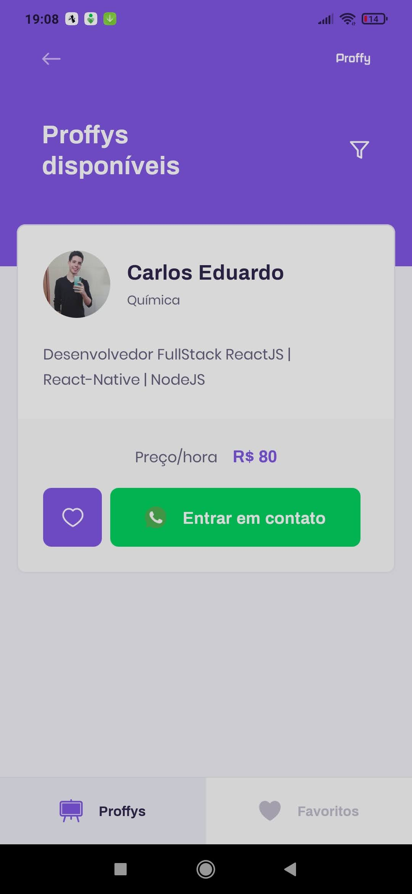

# Proffy


## 🔖 Sobre
Proffy é um projeto desenvolvido durante a NLW #2 ([Rocketseat](https://rocketseat.com.br/)), que tem por objetivo conectar professores e alunos, de uma forma intuitiva e dinâmica.
<br><br><br><br><br><br>

<div> 
  
  
</div>

## 🚀 Tecnologias utilizadas

- [TypeScript](https://www.typescriptlang.org/)
- [React](https://reactjs.org/)
- [React Native](https://reactnative.dev/)
- [Expo](https://expo.io/)
- [Node](https://nodejs.org/en/)
- [Express](https://expressjs.com/)
- [SQLite3](https://www.sqlite.org/index.html)
- [Knex](http://knexjs.org/)

## 🗂 Como baixar e iniciar o projeto

### API (Back-end)

```bash
# Abra um terminal e copie este repositório com o comando
$ git clone https://github.com/carlos-mattos/proffy.git
# ou use a opção de download.

# Entre na pasta server 
$ cd proffy/server

# Instale as dependências
$ yarn install

# Rode o servidor
$ yarn start
```

### Web (Front-end)

```bash
# Entre na pasta web com 
$ cd proffy/web

# Instale as dependências
$ yarn install

# Rode o aplicação
$ yarn start
```

### Mobile (App)

```bash
# Entre na pasta mobile com 
$ cd proffy/mobile

# Instale as dependências
$ yarn install

# Rode o app
$ yarn start

# Escaneie o QR Code exibido na janela do navegador.
```
<br>

Desenvolvido por [Carlos Eduardo](https://www.linkedin.com/in/carlos-eduardo-andrade-de-mattos-a060b1182/) 🤓
